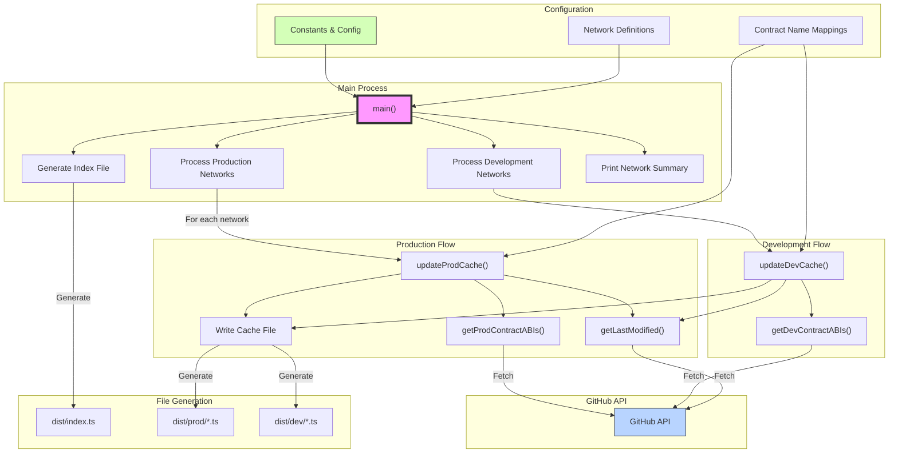

# Lit Protocol Contract Fetcher

A TypeScript utility for fetching and caching Lit Protocol contract ABIs and addresses. This tool maintains consistent contract data formats across the Lit Protocol ecosystem.

## Architecture



## Project Structure

```
src/
├── config/          # Configuration constants and network definitions
├── services/        # Core business logic services
├── types/           # TypeScript type definitions
├── utils/           # Utility functions
└── index.ts        # Main entry point
```

## Prerequisites

- Node.js 16 or higher
- GitHub Personal Access Token with read permissions (eg. fine grained token for public repositories only)

## Environment Variables

- `GH_API_KEY`: GitHub Personal Access Token (required)
- `DEV_BRANCH`: Development branch name (defaults to 'develop')

## Installation

```bash
yarn add @lit-protocol/contracts
```

## Usage

### Production Networks (from 'networks' repo)

```typescript
import { datilDev, datilTest, datil } from "@lit-protocol/contracts";

console.log("datilDev:", datilDev);
console.log("datilTest:", datilTest);
console.log("datil:", datil);
```

### Development Networks (from 'lit-assets' repo)

```typescript
import { develop } from "@lit-protocol/contracts";

console.log("Development contracts:", develop);
```

## Local Development

1. Clone the repository
2. Install dependencies:
   ```bash
   bun install
   ```
3. Set up environment variables:
   ```bash
   export GH_API_KEY=your_github_token
   export GH_LIT_ASSETS_READ_ONLY_API=your_github_token
   export LIT_ABI_SOURCE=prod  # or 'dev'
   ```
4. Run:

   ```bash
   DEV_BRANCH=develop bun run start
   ```

## CI/CD Workflow


## License

MIT
